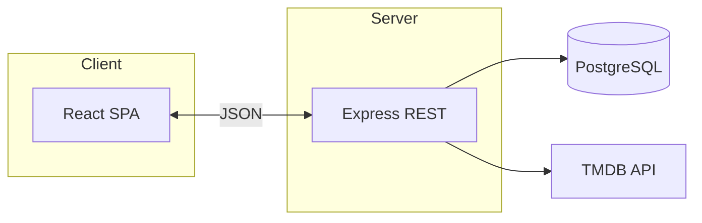

# ReelMates

**Movie tracking web app** — search (TMDB), watchlist, watched titles with ratings, public profiles by gametag.

Docs: [**EN**](./docs/PROJECT.md) · [**SL**](./docs/PROJEKT.md)

---

## Quick start

| Service | Command | URL |
|--------|---------|-----|
| API | `cd backend` → copy `.env.example` to `.env` → `npm run dev` | http://localhost:3001 — [`/api/health`](http://localhost:3001/api/health) |
| UI | `cd frontend && npm install && npm run dev` | http://localhost:5173 |

> [!TIP]
> Keep `TMDB_API_KEY` and database credentials **only** in `backend/.env` (never commit `.env`).

---

<strong>🇸🇮 Slovenščina</strong>

**ReelMates** — spletna aplikacija za sledenje filmom: iskanje (TMDB), osebni watchlist, ogledani naslovi z oceno, javni profili po **gametag-u**. Uporabniški vmesnik je v **angleščini**.

Zagon enak kot zgoraj: `backend` (`npm run dev`), `frontend` (`npm install`, `npm run dev`). Specifikacija: [SL](./docs/PROJEKT.md) / [EN](./docs/PROJECT.md).

---

MIT License — see [LICENSE](LICENSE).
